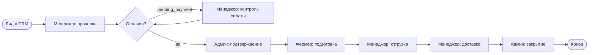
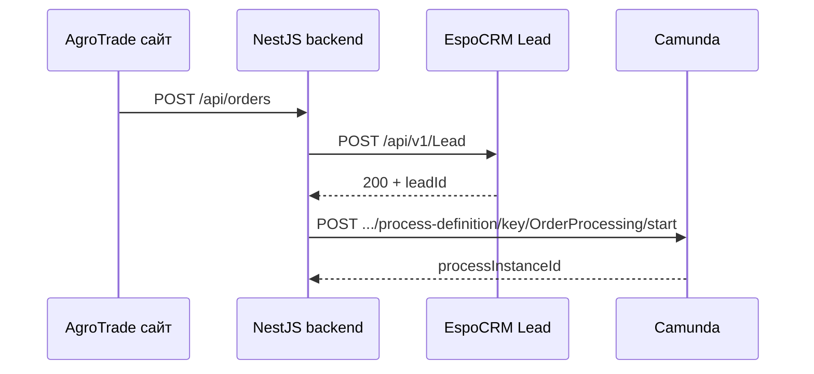

# ПР-06 — BPMS. Управление бизнес-процессами (AgroTrade)

> Шаблон отчёта для сдачи. Заполните скриншоты, ссылку на видео и блок «ИИ-диалоги» своими материалами.

---

## 1. Титульный лист

- **Работа:** ПР-06 — BPMS  
- **Продукт:** AgroTrade (MVP предзаказов фермерской продукции)  
- **ФИО, группа:** _заполнить_

---

## 2. Введение

AgroTrade — платформа, где **фермеры** публикуют кампании предзаказа, **покупатели (B2C/B2B)** бронируют объём и оплачивают предоплату, **администратор** модерирует заказы и кампании. Ключевой сценарий для BPMS — **обработка заказа** от момента появления заявки до закрытия.

Выбрана **Camunda Platform 7** (self-hosted, Docker): открытый BPMN, Tasklist/Cockpit как эквивалент канбана, REST API для интеграции CRM→BPMS (бонус +5 баллов). Не используется Bitrix24 (требование методички).

---

## 3. Этап 1: Исследование BPMS

### Сравнительная таблица

| Критерий | Camunda 7 | ELMA365 | n8n |
|----------|-----------|---------|-----|
| **Цена** | Open source, бесплатно локально | Freemium / trial | Self-host бесплатно |
| **Ease of Use** | Средняя; нужен BPMN | Высокая, no-code UI | Высокая для автоматизаций |
| **AI / Low-code** | Modeler + скрипты в шлюзах | ИИ-помощник в облаке | AI-ноды, мало BPMN |
| **Кастомизация** | Полный BPMN, роли, формы | Сильная в облаке | Слабее для user tasks |
| **Поддержка / RU** | EN-документация, сообщество | RU-сайт, академия | EN, активное комьюнити |

### Обоснование выбора

Camunda даёт **стандартный BPMN**, локальный запуск без облачной регистрации, **REST API** для связки с EspoCRM из NestJS backend. Для учебного проекта важны воспроизводимость (docker compose) и прозрачная карта процесса в Cockpit — это закрывает Этапы 3–4 и бонусную интеграцию.

**Ссылка:** https://camunda.com/platform/  
**Локальный UI:** http://localhost:8080/camunda/app/

---

## 4. Этап 2: Проектирование с ИИ

**Источник сценария:** ПР-03 — жизненный цикл заказа (`pending_payment` → `delivered` / `cancelled`), роли admin / farmer / buyer.

### Текстовое описание процесса

- **Вход:** создан Lead в CRM по новому заказу с сайта.  
- **Шаги:** менеджер проверяет → (ветка оплаты) → админ подтверждает → фермер готовит → менеджер организует отгрузку → менеджер фиксирует доставку → админ закрывает.  
- **Выход:** заказ завершён, процесс в End.  
- **Участники:** менеджер, администратор, фермер (≥2 роли, не только инициатор).

### BPMN (Mermaid — черновик; в реализации — файл `bpms/camunda/bpmn/order-processing.bpmn`)

### ИИ-диалоги

_Вставьте скриншоты переписки с ИИ (генерация BPMN / описания шагов)._

### Рефлексия (2–3 абзаца)

_Опишите, что скорректировали после генерации ИИ (ветка оплаты, роли, соответствие статусам AgroTrade)._

---

## 5. Этап 3: Реализация в BPMS

Процесс развёрнут в **Camunda Run** (`bpms/camunda/docker-compose.yml`). Файл BPMN содержит **7 user tasks** и **exclusive gateway** по переменной `status`. Переменные процесса передаются из backend при старте (поля заказа ПР-03).

### Таблица соответствия: ПР-03 → BPMS

| Поле / сущность (ПР-03) | Переменная Camunda | Тип |
|-------------------------|-------------------|-----|
| ID заказа | `orderId` | String |
| ID лида CRM | `leadId` | String |
| Статус заказа | `status` | String |
| Сумма | `totalAmount` | Double |
| Объём | `volume` | Double |
| Email покупателя | `buyerEmail` | String |
| Телефон | `buyerPhone` | String |
| Имя / компания | `buyerDisplayName`, `buyerCompanyName` | String |
| Кампания | `campaignTitle` | String |

### Таблица соответствия: ПР-05 → BPMS

| Роль AgroTrade / CRM | Группа Camunda | User Tasklist |
|----------------------|----------------|---------------|
| Менеджер | `manager` | `agro_manager` |
| Администратор | `admin` | `agro_admin` |
| Фермер | `farmer` | `agro_farmer` |

### Скриншоты (вставить в отчёт)

- [ ] Cockpit — диаграмма процесса OrderProcessing  
- [ ] Cockpit — список экземпляров (3–4 businessKey)  
- [ ] Tasklist — задачи у разных ролей  
- [ ] (опц.) Admin — группы manager / admin / farmer  

---

## 6. Этап 4: Прогон и демо

- [ ] Скриншот Tasklist / Cockpit с карточками в разных стадиях  
- [ ] **Ссылка на видео:** _YouTube / Drive / Яндекс.Диск_  
- [ ] Скриншоты с видимым аккаунтом студента  

**Рефлексия (3–5 предложений):** _что показали на демо, какие роли участвовали._

---

## 7. Этап 5: Интеграция CRM → BPMS (+5 баллов)

### Схема

### Маппинг полей

Lead в EspoCRM → переменные процесса (см. таблицу Этап 3). Минимум одно поле: `orderId` + `leadId`.

### Скриншот кода

Файлы:

- `backend/src/modules/crm/crm.service.ts` — после `postLead` вызывается BPMS  
- `backend/src/modules/bpms/bpms.service.ts` — `startOrderProcess()`

### Демо интеграции

_Видео: заказ на сайте → Lead в Espo → экземпляр процесса в Cockpit._

### Рефлексия бонуса

_Что получилось / что было сложно (ожидание Camunda, auth demo/demo)._

---

## 8. Общая рефлексия

_Как изменилось понимание процессов; мнение о BPMS; как ПР-06 встроилась в экосистему (веб + CRM + BPMS)._

---

## 9. Технические детали

| Параметр | Значение |
|----------|----------|
| ИИ-ассистент | _модель, ссылка_ |
| Чистое время | _ч, мин_ |
| Camunda | http://localhost:8080 |
| EspoCRM | http://localhost:8085 |
| Backend | http://127.0.0.1:5051 |
| Документация Camunda | https://docs.camunda.org/manual/7.21/ |

---

## Приложения

- `bpms/camunda/bpmn/order-processing.bpmn`  
- `bpms/camunda/scripts/seed-identity.mjs`  
- `docs/PR-06-BPMS-REPORT.md` (этот файл)
